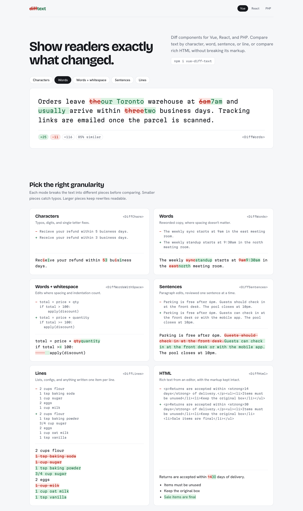

# diff-text

Text and HTML diff components for Vue, React, and PHP.

diff-text shows what changed between two versions of a piece of text. It compares by character,
word, word-plus-whitespace, sentence, or line, and it can diff rich HTML while keeping the markup
valid. For longer text there are unified and side-by-side line views with line numbers and folded
unchanged context, plus a stats badge with added / removed / unchanged counts and a similarity
percentage.

It is built for prose and paragraphs (policies, articles, CMS content), not for code review.

**Live demo:** [Vue](https://sitefinitysteve.github.io/diff-text/vue/) · [React](https://sitefinitysteve.github.io/diff-text/react/) · [PHP](https://sitefinitysteve.github.io/diff-text/php/)



*The shared demo page, rendered here by the Vue package. The React and PHP demos render the same page.*

## Packages

| Package | Install | Docs |
|---------|---------|------|
| [vue-diff-text](https://www.npmjs.com/package/vue-diff-text) (Vue 3) | `npm i vue-diff-text` | [packages/vue/README.md](packages/vue/README.md) |
| [react-diff-text](https://www.npmjs.com/package/react-diff-text) (React 18 and 19) | `npm i react-diff-text` | [packages/react/README.md](packages/react/README.md) |
| [sitefinitysteve/php-diff-text](https://packagist.org/packages/sitefinitysteve/php-diff-text) (PHP 8.1+) | `composer require sitefinitysteve/php-diff-text` | [packages/php/README.md](packages/php/README.md) |

All three render the same markup and share one stylesheet (`style.css`, themeable through
`--text-diff-*` custom properties). The npm packages bundle their only dependency (jsdiff);
the PHP package needs only `ext-mbstring`.

`packages/core` (`@diff-text/core`) is a private workspace package: the TypeScript reference
implementation that the Vue and React packages bundle at build time. It is not published.

## Feature matrix

| Feature | Vue | React | PHP |
|---------|-----|-------|-----|
| Character diff | `<DiffChars>` | `<DiffChars>` | `DiffText::chars()` / `DiffChars` |
| Word diff | `<DiffWords>` | `<DiffWords>` | `DiffText::words()` / `DiffWords` |
| Word diff, whitespace significant | `<DiffWordsWithSpace>` (alias `TextDiff`) | `<DiffWordsWithSpace>` (alias `TextDiff`) | `DiffText::wordsWithSpace()` / `DiffWordsWithSpace` |
| Sentence diff | `<DiffSentences>` | `<DiffSentences>` | `DiffText::sentences()` / `DiffSentences` |
| Line diff (inline) | `<DiffLines>` | `<DiffLines>` | `DiffText::lines()` / `DiffLines` |
| HTML diff | `<DiffHtml>` | `<DiffHtml>` | `DiffText::html()` / `DiffHtml` |
| Unified line view | `<DiffUnified>` | `<DiffUnified>` | `DiffText::unified()` / `DiffUnified` |
| Side-by-side line view | `<DiffSplit>` | `<DiffSplit>` | `DiffText::split()` / `DiffSplit` |
| Stats badge | `<DiffStats>` | `<DiffStats>` | `DiffText::stats()` / `DiffStats` |
| Similarity (0 to 1) | `computeSimilarity()` | `computeSimilarity()` | `DiffText::similarity()` / `Similarity::compute()` |
| Raw change list | `computeDiff()` | `computeDiff()` | `DiffWords::diff()` etc. |
| Line hunks | `buildHunks()` | `buildHunks()` | `DiffUnified::hunks()` |
| Split rows | `buildSplitRows()` | `buildSplitRows()` | `DiffSplit::hunks()` |
| Stats data | `computeStats()`, `lineStats()` | `computeStats()`, `lineStats()` | `DiffStats::compute()`, `fromChanges()`, `fromHunks()` |
| HTML diff result object | `diffHtml()` | `diffHtml()` | no (markup only) |
| HTML helpers | `normalizeQuotes()`, `stripFormattingTags()` | same | `NormalizeHtml::normalizeQuotes()`, `stripFormattingTags()` |
| Expandable collapsed rows | yes (click to expand) | yes (click to expand) | no (static rows) |
| `next()` / `prev()` / `goTo()` / `count` | yes, via template ref | yes, via `ref` (`forwardRef`) | no (output carries `data-change-index` for your own script) |
| Options: `ignoreCase`, `ignoreWhitespace`, `contextLines`, ... | yes | yes | yes |

## How parity is enforced

- [SPEC.md](SPEC.md) is the behavior contract: tokenizers, the exact Myers variant, whitespace
  post-processing, similarity, the line and split models, stats, the HTML diff, and the canonical
  markup for every view. It is written so the PHP port can be done without reading JavaScript.
- `fixtures/*.json` are the executable form of SPEC.md. They are generated from `packages/core`
  with `npm run fixtures`. If the text and the fixtures disagree, the fixtures win.
- All three test suites run the fixtures: the Vue and React suites mount every case and compare the
  rendered markup, and the PHP suite compares change lists, markup, hunks, and stats byte for byte
  (the HTML diff included: one engine, SPEC.md section 12).
- CI runs `npm run fixtures:check`, which fails if the committed fixtures differ from what core
  produces.
- The demo page is shared too: `demo/` holds the CSS, the sample text, and the template contract
  that each package's demo follows ([demo/README.md](demo/README.md)).

## Development

Requires Node 20+ and, for the PHP package, PHP 8.1+ with Composer.

```bash
npm install            # installs the core, vue and react workspaces
npm test               # core, Vue and React test suites
npm run lint
npm run test:php       # PHP suite (run `composer install` in packages/php first)
npm run fixtures       # regenerate fixtures/*.json from packages/core
npm run fixtures:check # fail if the committed fixtures are out of date
npm run build          # build the Vue and React packages
```

Demos:

```bash
cd packages/vue/demo && npm install && npm run dev     # http://localhost:5174
cd packages/react/demo && npm install && npm run dev   # http://localhost:5175
cd packages/php && composer demo                       # http://127.0.0.1:8080
```

Layout:

```
demo/            shared demo CSS, sample text, template contract
fixtures/        canonical test cases, generated from core
packages/core/   @diff-text/core, the TypeScript reference implementation (private)
packages/vue/    vue-diff-text
packages/react/  react-diff-text
packages/php/    php-diff-text
scripts/         fixture generation and checks
SPEC.md          the behavior contract
```

## Releases

All three packages are released together, from your machine, with one command:
`scripts/release.sh --go` publishes to npm and Packagist, tags `vX.Y.Z`, creates the GitHub
releases and deploys the demo site. See [RELEASING.md](RELEASING.md) for setup, the step-by-step
process and manual fallbacks.

## License

MIT
